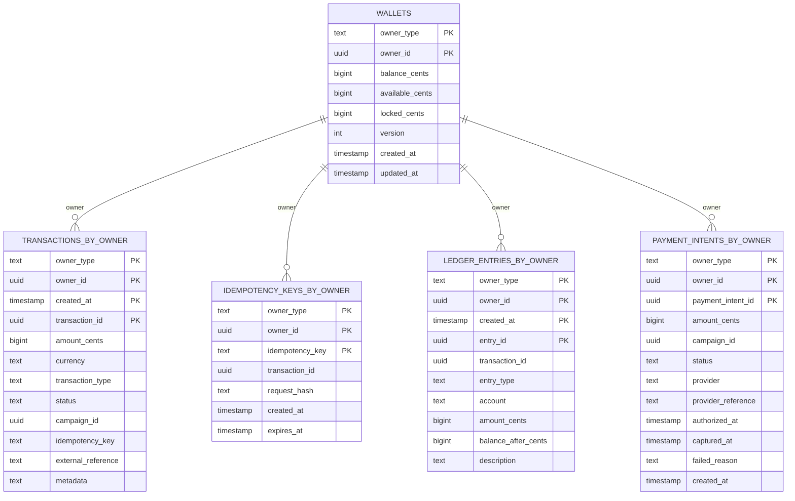
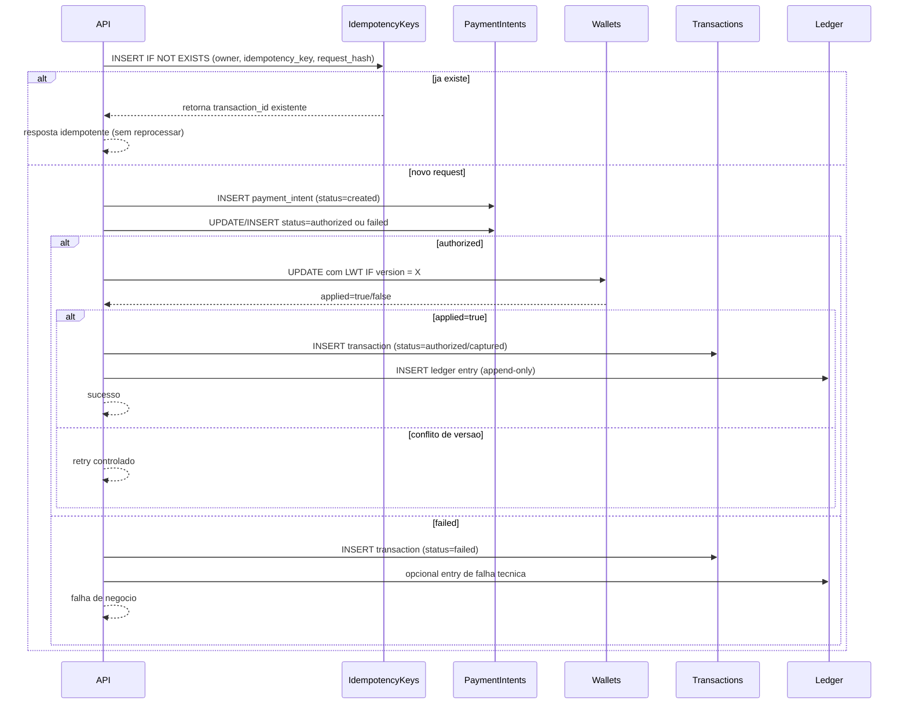

# Modelagem de Transacoes e Wallets

## Objetivo da modelagem

A modelagem foi pensada em cima de 3 objetivos:

1. Consistencia pratica em Cassandra.
2. Idempotencia forte para evitar duplicidade.
3. Trilha contabil auditavel.

## Decisao central

Todas as tabelas de transacao usam `owner_type + owner_id` como chave de particao porque o acesso principal do sistema e por dono (owner).

## Separacao por responsabilidade

- `wallets`: estado atual consolidado (saldo, disponivel, bloqueado, versao).
- `transactions_by_owner`: historico de transacoes por owner.
- `idempotency_keys_by_owner`: evita reprocessar o mesmo request.
- `ledger_entries_by_owner`: trilha contabil append-only.
- `payment_intents_by_owner`: ciclo de autorizacao e captura com provedor.

## Diagrama de entidades

Nota: no Mermaid ER usamos `metadata` como `text` apenas para compatibilidade de parser. No CQL real, esse campo e `map<text, text>`.

## Fluxo de dados da transacao

## Onde os campos sao usados na pratica

### wallets

- `balance_cents`: saldo total contábil.
- `available_cents`: saldo disponivel para novos debitos.
- `locked_cents`: saldo reservado para operacoes em andamento.
- `version`: controle de concorrencia otimista via LWT.
- `updated_at`: auditoria e observabilidade de atualizacao.

Caso:
Dois debitos simultaneos leem a mesma versao. Apenas um `IF version = X` aplica; o outro faz retry.

### transactions_by_owner

- `created_at`: ordenacao da timeline.
- `transaction_id`: identidade unica da transacao.
- `amount_cents`, `currency`, `transaction_type`: regra de negocio e apresentacao.
- `status`: estado da transacao (pending, authorized, captured, failed).
- `campaign_id`: contexto de campanha.
- `idempotency_key`: rastreio de retries.
- `external_reference`: reconciliacao com sistema externo.
- `metadata`: dados adicionais flexiveis.

Caso:
Ao consultar extrato do owner, os registros sao lidos por particao e ordenados por `created_at DESC`.

### idempotency_keys_by_owner

- `idempotency_key`: chave unica por owner.
- `transaction_id`: devolve sempre a mesma transacao no retry.
- `request_hash`: valida que payload nao mudou entre tentativas.
- `expires_at`: janela de retencao/limpeza.

Caso:
Cliente reenviou request por timeout. O sistema encontra a chave e devolve o mesmo resultado, sem novo debito.

### ledger_entries_by_owner

- `entry_type`: tipo do lancamento (debit, credit, fee).
- `account`: conta contabil afetada.
- `amount_cents`: valor do lancamento.
- `balance_after_cents`: saldo apos o lancamento.
- `transaction_id`: vinculo da entrada com a transacao.
- `description`: contexto humano da linha.

Caso:
Em auditoria, o ledger permite reconstruir cronologicamente como o saldo evoluiu.

### payment_intents_by_owner

- `status`: andamento da intencao (created, authorized, captured, failed).
- `provider`: nome do gateway/BaaS.
- `provider_reference`: id externo para reconciliacao.
- `authorized_at` e `captured_at`: tempos de cada etapa.
- `failed_reason`: diagnostico de erro.

Caso:
Autorizou no provedor mas falhou captura; os timestamps e status mantem o historico completo para suporte e reconciliacao.

## Como isso prepara o ProcessTransactionService

1. Garante idempotencia no inicio (`idempotency_keys_by_owner`).
2. Registra ciclo de autorizacao (`payment_intents_by_owner`).
3. Atualiza saldo com seguranca (`wallets` + `version` via LWT).
4. Grava historico de negocio (`transactions_by_owner`).
5. Grava trilha contabil (`ledger_entries_by_owner`).
